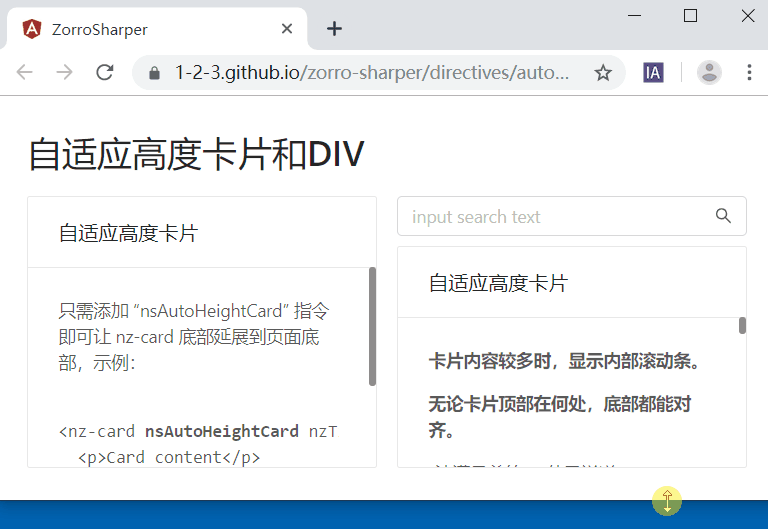

# ZORRO Sharper

> Un conjunto de directivas para hacer que la librería de componentes Zorro sea más simple, fácil de usar y potente.

[](https://www.npmjs.com/package/zorro-sharper)
[](https://github.com/1-2-3/zorro-sharper#license)
[](https://img.shields.io/bundlephobia/min/zorro-sharper)

Una forma súper ligera de mejorar y simplificar la [Librería de componentes ZORRO](https://github.com/NG-ZORRO/ng-zorro-antd).

Filosofía de diseño: [Dejar de "encapsular" componentes](https://segmentfault.com/a/1190000020337985).

简体中文 | [English](README-en_US.md)

## Características

- Tarjetas y DIVs con altura adaptativa
- Pestañas con altura adaptativa
- Tablas con altura adaptativa
- Simplificación de la paginación física en selectores (dropdowns)
- Asignación automática de valores en selectores
- Simplificación de la información de validación de formularios
- Simplificación del feedback de validación de formularios
- Tarjetas con giro 3D




## Instalación

```sh
npm install zorro-sharper --save
```

## Uso

Importa `ZorroSharperModule` en cada módulo donde necesites utilizar los componentes.

```ts
import { NgModule } from "@angular/core";
import { NgZorroAntdModule } from "ng-zorro-antd";
import { ZorroSharperModule } from "zorro-sharper";

@NgModule({
  imports: [NgZorroAntdModule, ZorroSharperModule],
  declarations: [],
  exports: []
})
export class DirectiveDemoModule {}
```

Usa las directivas o componentes donde sea necesario.

```html
<nz-card nsAutoHeightCard nzHoverable nzTitle="Tarjeta con altura adaptativa">
  <p>Simplemente añade la directiva “nsAutoHeightCard” para que el fondo de nz-card se extienda hasta la parte inferior de la página.</p>
</nz-card>
```

## License

MIT
