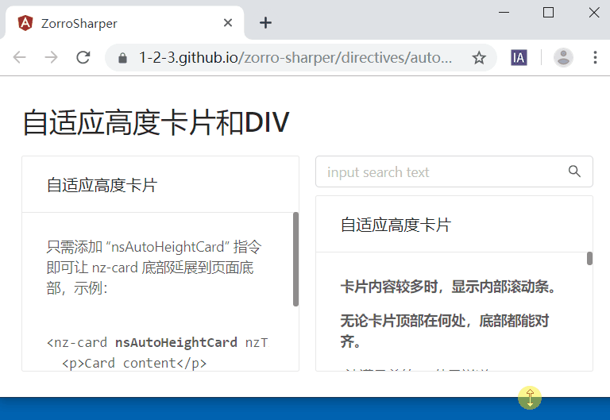

# ZORRO Sharper

> 让 zorro 组件库更简单、更易用、更强大的指令集

[](https://www.npmjs.com/package/zorro-sharper)
[](https://github.com/1-2-3/zorro-sharper#license)
[](https://img.shields.io/bundlephobia/min/zorro-sharper)

使用超级轻量化的方式来增强、简化 [ZORRO 组件库](https://github.com/NG-ZORRO/ng-zorro-antd)。

设计理念：[不再“封装”组件](https://segmentfault.com/a/1190000020337985)。

简体中文 | [English](README-en_US.md)

## 特性

- 自适应高度的卡片和 DIV
- 自适应高度标签页
- 自适应高度的表格
- 简化下拉框物理分页
- 下拉框自动赋值
- 简化表单验证信息
- 简化表单验证反馈



## 安装

```sh
npm install zorro-sharper --save
```

## 使用

在每一个需要使用组件的 module 中引入 ZorroSharperModule。

```ts
import { NgModule } from "@angular/core";
import { NgZorroAntdModule } from "ng-zorro-antd";
import { ZorroSharperModule } from "zorro-sharper";

@NgModule({
  imports: [NgZorroAntdModule, ZorroSharperModule],
  declarations: [],
  exports: []
})
export class DirectiveDemoModule {}
```

在需要的地方使用指令或组件。

```html
<nz-card nsAutoHeightCard nzHoverable nzTitle="自适应高度卡片">
  <p>只需添加 “nsAutoHeightCard” 指令即可让 nz-card 底部延展到页面底部.</p>
</nz-card>
```

## License

MIT
